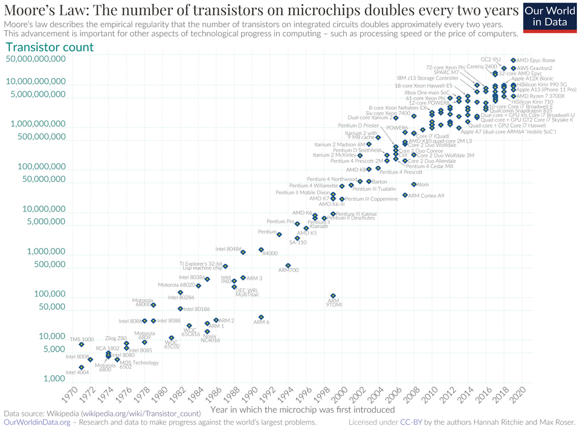

# Technology 
**Date:** 9-24-2026
**Keywords:**
Moore's Law, Technology, Growth, AI

Earlier in class, Dr. Thiruvathukal spoke about how AI isn't really a new technology, but
something that has been in development for well over several decades. The technology made 
a groundbreaking breakthrough in 2022 with GPT, and was released to the public. 

Despite it being in development for several decades, many people feel as if this is the beginning
of a whole new technology-- and with that there is a lot of mixed sentiments towards technology.

## Moore's Law

In computing, particularly in hardware-- 
[Moore's law states that as time progresses, we are able to fit more and more 
transistors on smaller dies with less cost.](https://www.intel.com/content/www/us/en/newsroom/resources/moores-law.html) 
He then outlined in his research that this growth is grows exponentially with a `log2`
base every year-- meaning that every year that progresses, we are seeing double the amount of
transistors on each die. This was then adjusted to account for every two years, but the law
remained otherwise the same.

### Human comprehension of technological growth
If we consult the graph above, the line looks linear. However that is because Moore's Law is more accurately
described as a **piecewise function**. While the underlying math escapes my area of study and expertise; we are
quite interested in what this means overall for the advent of technologies, and what that looks like overall for
the human brain. Given that humanity is like any other known living creature-- a living breathing animal: we are
bound by evolution. Evolution for humans is very slow; it takes generations upon generations for us to experience 
any changes to our physiology or anatomy, and then presumably-- some time for us to adapt to those changes.

> Perhaps there is someone out there who has written more and done more research. If so, please direct them as a suggestion
in my issues tab : _ )

Granted, we are still studying the effects of the internet and the rapid growing usage of computers in our everyday
lives, but the thing about this research is that it's a gradual process. We humans are too slow to adjust for the 
ever-so rapid changes that we are encountering day-by-day in society caused by technology. Even just ballparking our
growth to say, a linear development we are still lagging behind drastically; We shadow in contrast to the growth at which 
technology progresses. 

Sure, you can argue that technology is an artificial development, 

> Humans build these systems, therefore we can adapt to these changes.

But this line of thinking is fallacious, and not at all true of a statement. We are still studying the effects of 
technology to study the impact on the human brain, [this paper is but one example of many others like it that demonstrate this.](https://pmc.ncbi.nlm.nih.gov/articles/PMC7366944/)

Even then let us look at this from a different perspective: let's use the microscope as an example. Sure there is a tangible, real object that was made; but
the use of it allowed us to see the microscopic world and beyond that showed us that there is way more to Earth than what we can see with our bare senses.

> The idea of `P?=NP` also popped into my head. For context, if a computer could find a solution in polynomial time it is *computationally efficient*, outside
of that range then it is classified as NP-hard. We can't necessarily classify a problem for humans in particular because it is intended for machines as a matter
of P?=NP, but we can still assume that most computational problems are distinct from what a human can solve in a reasonable time.

Anyways, my point being we are not computers. We can't comprehend complex growth but when things such as AI, or having what is essentially a supercomputer fit inside
of our pocket we are just not able to comprehend just how marvelous this growth really is.

## Tangent to this show called Pantheon
I can't mention Moore's law without making the pop culture reference to a show I love called Pantheon. I think I have made a reference to the show once a few weeks ago in
another writing, but if I haven't let me introduce it here:

**SPOILER WARNING:**
I suggest you watch the show before continuing on here, because this section is filled with so many spoilers and the show is so great that I would rather
you spend some time watching the show before continuing on. This is one show that is warrants a blind first watch, as it contributes so much to the beauty
of the story.

# Spoilers ahead...
Ok now that I have the spoiler warning out of the way, let me **ACTUALLY** bring up the reason why I brought the show up in the first place.

The show itself is a science fiction about how the protagonist Maddie Kim traverses a world in the age of this new technological development called
"Uploaded Intelligence". What Uploaded Intelligence (UI) *is* essentially is the digital uploading of a human brain-- an exact 1:1 copy of it; every memory,
every thought, and every idea is directly translated to code and UI acts as the digital copy of someone's personality. The show makes a nod to Moore's law in
the [Fifth Episode: Zero Daze](https://tvshowtranscripts.ourboard.org/viewtopic.php?t=56678) where the ex-wife of one of the three existing UI's is speaking to
Cody; whose wife Laurie was uploaded against her will.

The context of Moore's law in this case was the observation that technology grows at an exponential rate, and the effect isn't immediately clear to humans.
Later on in the series, she's proven to be right; as UI became more and more mainstream; more people began to upload themselves and it changed how people
interacted with reality all-together. Within 20 years, Earth gravitated towards mass adoption of the technology. Even the UI's themselves operate on different
levels of time dilation because they're all technically 'programs' within a computer.

## Conclusive thoughts
Despite digital technology being human creations-- people will never be able to grasp the sheer magnitude of how
small of a time frame the technology we have now is in comparison to the entirety of human history. Only a couple hundred years ago,
artisanal labor was slowly replaced in favor for the mass production of the machine. Today we are faced with a similar rhythm in history.

Despite that, something is still just off-putting to me about this technology. I just can't put it into words.

# Bibliography
